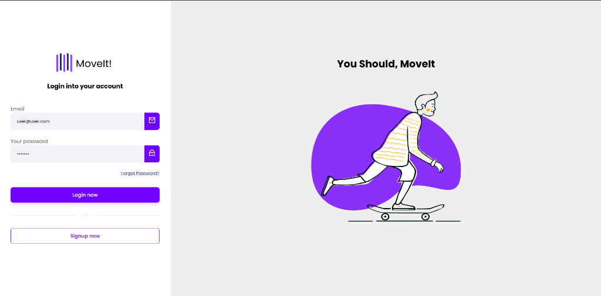
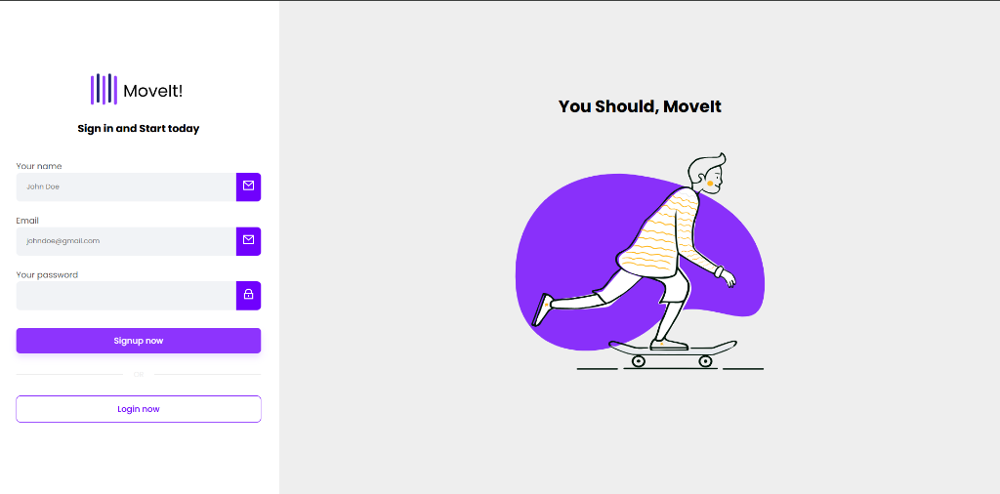

# Login Auth API & Web Client

Sistema completo de autenticação de usuários contendo uma API baseada em JSON Web Token (JWT) no Backend e uma interface visual interativa no Frontend para criação, gerenciamento e validação de acessos.

---

## 📸 Telas da Aplicação

### Tela de Login


### Tela de Registro (Signup)


---

## 🚀 Tecnologias e Ferramentas

### 💻 Frontend
*   **Angular 17** (Framework Web)
*   **TypeScript**
*   **SCSS** (Estilização)
*   **ngx-toastr** (Para exibição de mensagens de sucesso e erro)

### ⚙️ Backend
*   **Java 17**
*   **Spring Boot** (Spring Security, Spring Data JPA, Global Exception Handler)
*   **Maven** (Gerenciamento de dependências)
*   **MySQL** (Banco de dados relacional)
*   **JWT (JSON Web Token)** (Autenticação e autorização via Bearer Tokens)
*   **CORS** (Configurado para permitir a comunicação com o Frontend)

---

## 📋 Pré-requisitos

Para rodar este projeto na sua máquina, você precisará ter instalado:
*   Java Development Kit (JDK) 17
*   Maven
*   MySQL Server (rodando localmente na porta padrão 3306)
*   Node.js e NPM
*   Angular CLI (Opcional, mas recomendado instalar globalmente: `npm install -g @angular/cli`)
*   IDE recomendada: IntelliJ IDEA (Backend) e VS Code (Frontend)

---

## ⚙️ Configurações de Ambiente (Backend)

A aplicação utiliza variáveis de ambiente para ocultar dados sensíveis. Antes de iniciar o projeto, configure as seguintes variáveis (por exemplo, na configuração de *Run/Debug* do seu IntelliJ):

*   `DATABASE_USERNAME`: Seu usuário do MySQL (ex: `root`).
*   `DATABASE_PASSWORD`: Sua senha do MySQL.
*   `JWT_KEY`: (Opcional) A chave secreta do JWT. O projeto já conta com uma chave padrão no `application.properties` para rodar em ambiente de desenvolvimento (`dev`).

*Nota: O servidor está configurado para rodar na porta **8081** e o Hibernate criará o banco de dados `authdb` automaticamente caso ele não exista.*

---

## 🛠️ Como Executar o Projeto Localmente

### 1. Backend (`login-auth-api`)
1. Abra a pasta `login-auth-api` na sua IDE.
2. Certifique-se de que o SDK configurado na IDE é o **Java 17**.
3. Rode o comando ou utilize a interface da IDE para fazer o **Reload do Maven** e atualizar as dependências.
4. Adicione as variáveis de ambiente `DATABASE_USERNAME` e `DATABASE_PASSWORD`.
5. Execute a classe principal da aplicação (Run). 
6. A API estará disponível em: `http://localhost:8081`

### 2. Frontend (`login-auth-fe`)
1. Abra um terminal e acesse a pasta do frontend:
   ```bash
   cd login-auth-fe
   ```
2. Instale as dependências:
   ```bash
   npm install
   ```
3. Execute o servidor de desenvolvimento:
   ```bash
   npm start
   ```
   *(ou `ng serve` se tiver o Angular CLI instalado globalmente)*
4. O frontend estará disponível no navegador em: `http://localhost:4200`

---

## 🛣️ Rotas da API e Documentação (Swagger)

A aplicação possui uma documentação interativa da API utilizando **Swagger**. A interface do Swagger foi parametrizada para ser acessada publicamente, permitindo visualizar e testar os endpoints sem a necessidade de enviar um *Bearer Token*.

Com o backend rodando, você pode acessar a documentação do Swagger através do seu navegador (geralmente na rota `http://localhost:8081/swagger-ui/index.html` ou similar).

Os principais endpoints estão resumidos abaixo:

### 🔐 Autenticação (`auth-controller`)

| Método | Endpoint | Descrição |
| :--- | :--- | :--- |
| `POST` | `/v1/auth/register` | Cria uma nova conta de usuário. |
| `POST` | `/v1/auth/login` | Realiza login e gera o Bearer Token. |

#### Formato dos Dados (JSON)

**Requisição: `/v1/auth/register`**
```json
{
  "name": "Seu Nome",
  "email": "email@exemplo.com",
  "password": "sua_senha_segura"
}
```

**Requisição: `/v1/auth/login`**
```json
{
  "email": "email@exemplo.com",
  "password": "sua_senha_segura"
}
```

**Resposta de Sucesso (Registro e Login)**
```json
{
  "name": "Seu Nome",
  "token": "eyJhbGciOiJIUzI1NiIsInR5cCI6IkpXVCJ9..."
}
```

### 👤 Usuários (`user-controller`)

| Método | Endpoint | Descrição |
| :--- | :--- | :--- |
| `GET` | `/v1/user` | Rota protegida (Requer Bearer Token no cabeçalho). |

*Importante: Para acessar a rota `/v1/user`, é necessário enviar o token obtido no login através do Header da requisição HTTP: `Authorization: Bearer <seu_token>`.*
